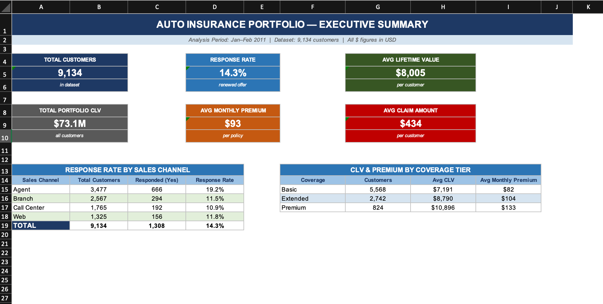

🚗 Auto Insurance Customer Analysis
An end-to-end data analysis project examining 9,134 auto insurance customer records to identify renewal response drivers, customer lifetime value distribution, and segment profitability across sales channels and coverage tiers.

🎯 Objectives
What customer and policy characteristics are associated with higher renewal response rates?
Which sales channels and coverage tiers produce the most valuable customers?
How is Customer Lifetime Value (CLV) distributed across the portfolio, and what demographic factors correlate with it?

📊 Dataset
Field    Details
Source   IBM Sample Dataset (via Kaggle)
Records  9,134 customers
Fields   24 (demographics, policy details, claims, renewal response) 
Period   Jan–Feb 2011 policy renewal snapshot
*Key fields include: Customer Lifetime Value, Response (renewal Y/N), Sales Channel, Coverage, Monthly Premium Auto, Total Claim Amount, State, Policy Type, and more.*

🔍 Key Findings
Response rate is just 14.3% overall — renewal campaigns have significant room for targeting improvement
Premium coverage customers have ~2× the CLV of Basic coverage customers across all sales channels, representing a clear upsell opportunity
The Web channel shows the best Premium-to-Claim ratio, suggesting it is the most cost-efficient acquisition channel despite lower volume
California drives the most portfolio value (3,150 customers, highest avg CLV), while Washington has the lowest response rate across all channels
The top 10% of customers by CLV (>$17K) represent a disproportionate share of total portfolio value and warrant dedicated retention focus

📂 Workbook Overview
The Excel workbook contains 8 sheets:
Sheet                        Description
📋 Data Dictionary            Documents all 24 fields — data types, measurement scales,                                quality notes, and ambiguity flags

📊 Raw Data (Sample)          First 500 rows with formatted currency, number, and date                                 fields 

📈 Executive Summary          KPI cards and summary tables by sales channel and coverage                               tier

🔄 Pivot — State × Policy     CLV and response rate cross-tabulated by State and Policy                                Type

🔄 Pivot — Segment Analysis   Profitability matrix by Sales Channel × Coverage,                                        including Premium-to-Claim Ratio

🔄 Pivot — CLV Distribution   CLV banding, demographic breakdowns, and conditional                                     formatting
🗄️ SQL Reference              Five SQL queries replicating each pivot analysis

📝 Methodology                Assumptions, data quality findings, limitations, and                                     recommendations

🗄️ SQL Highlights
The workbook includes a SQL Reference sheet with queries equivalent to each pivot analysis. Example:
sql-- Response rate by sales channel
SELECT
    sales_channel,
    COUNT(*) AS total_customers,
    SUM(CASE WHEN response = 'Yes' THEN 1 ELSE 0 END) AS responded,
    ROUND(
        100.0 * SUM(CASE WHEN response = 'Yes' THEN 1 ELSE 0 END) / COUNT(*), 1
    ) 
AS response_rate_pct
FROM auto_insurance
GROUP BY sales_channel
ORDER BY response_rate_pct DESC;

*Queries cover GROUP BY aggregations, CASE WHEN banding, NULLIF for safe division, and percentile subqueries for high-value customer segmentation.*

🛠️ Tools Used

Microsoft Excel — pivot tables, formulas (AVERAGE, SUM, IF), conditional formatting, data organization
SQL — analytical queries for reproducibility and cross-validation

📌 Data Quality Notes

No missing values were found across all 24 columns
$0 Income values are intentional — they correspond to Unemployed and Disabled customers, confirmed by cross-tabulation with EmploymentStatus
CLV is right-skewed (mean $8,005 vs. median $5,780) — averages in pivot tables should be interpreted with this in mind
The narrow date range (Jan–Feb 2011) indicates this is a renewal snapshot, not a longitudinal dataset — time-series trend analysis is not applicable

💡 Recommendations

Upsell Basic → Premium — the CLV gap justifies targeted upgrade campaigns
Investigate Washington retention — lowest response rate across all channels
Shift marketing spend toward Web — best efficiency ratio
Build a high-value customer program — top 10% CLV customers need white-glove retention
Test offer types in Nevada Corporate Auto — unusually high response rate worth replicating

*Project completed for personal learning and experience purposes*
